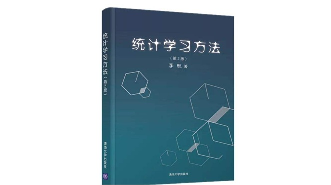

# Learn-Statistical-Learning-Method, Second Edition
  
Implementation of Statistical Learning Method  
《统计学习方法》第二版，算法实现。 

第1章：统计学习方法概论 [least_sqaure_method.ipynb](https://nbviewer.jupyter.org/github/hktxt/Learn-Statistical-Learning-Method/blob/master/%E7%AC%AC01%E7%AB%A0%20%E7%BB%9F%E8%AE%A1%E5%AD%A6%E4%B9%A0%E6%96%B9%E6%B3%95%E6%A6%82%E8%AE%BA/least_sqaure_method.ipynb)  
第2章：感知机 [perceptron.ipynb](https://nbviewer.jupyter.org/github/hktxt/Learn-Statistical-Learning-Method/blob/master/%E7%AC%AC02%E7%AB%A0%20%E6%84%9F%E7%9F%A5%E6%9C%BA/perceptron.ipynb)   
第3章：k近邻法 [KNN.ipynb](https://nbviewer.jupyter.org/github/hktxt/Learn-Statistical-Learning-Method/blob/master/%E7%AC%AC03%E7%AB%A0%20k%E8%BF%91%E9%82%BB%E6%B3%95/KNN.ipynb)  
第4章：朴素贝叶斯法 [NaiveBayes.ipynb](https://nbviewer.jupyter.org/github/hktxt/Learn-Statistical-Learning-Method/blob/master/%E7%AC%AC04%E7%AB%A0%20%E6%9C%B4%E7%B4%A0%E8%B4%9D%E5%8F%B6%E6%96%AF%E6%B3%95/NaiveBayes.ipynb)  
第5章：决策树 [DT.ipynb](https://nbviewer.jupyter.org/github/hktxt/Learn-Statistical-Learning-Method/blob/master/%E7%AC%AC05%E7%AB%A0%20%E5%86%B3%E7%AD%96%E6%A0%91/DT.ipynb)  
第6章：逻辑斯蒂回归与最大熵模型 [LR.ipynb](https://nbviewer.jupyter.org/github/hktxt/Learn-Statistical-Learning-Method/blob/master/%E7%AC%AC06%E7%AB%A0%20%E9%80%BB%E8%BE%91%E6%96%AF%E8%92%82%E5%9B%9E%E5%BD%92%E4%B8%8E%E6%9C%80%E5%A4%A7%E7%86%B5%E6%A8%A1%E5%9E%8B/LR.ipynb)  
第7章：支持向量机 [SVM.ipynb](https://nbviewer.jupyter.org/github/hktxt/Learn-Statistical-Learning-Method/blob/master/%E7%AC%AC07%E7%AB%A0%20%E6%94%AF%E6%8C%81%E5%90%91%E9%87%8F%E6%9C%BA/SVM.ipynb)  
第8章：提升方法 [Adaboost.ipynb](https://nbviewer.jupyter.org/github/hktxt/Learn-Statistical-Learning-Method/blob/master/%E7%AC%AC08%E7%AB%A0%20%E6%8F%90%E5%8D%87%E6%96%B9%E6%B3%95/Adaboost.ipynb)  
第9章：EM算法及其推广 [EM.ipynb](https://nbviewer.jupyter.org/github/hktxt/Learn-Statistical-Learning-Method/blob/master/%E7%AC%AC09%E7%AB%A0%20EM%E7%AE%97%E6%B3%95%E5%8F%8A%E5%85%B6%E6%8E%A8%E5%B9%BF/EM.ipynb)  
第10章：隐马尔可夫模型 [HMM.ipynb](https://nbviewer.jupyter.org/github/hktxt/Learn-Statistical-Learning-Method/blob/master/%E7%AC%AC10%E7%AB%A0%20%E9%9A%90%E9%A9%AC%E5%B0%94%E5%8F%AF%E5%A4%AB%E6%A8%A1%E5%9E%8B/HMM.ipynb)  
第11章：条件随机场 [CRF.ipynb](https://nbviewer.jupyter.org/github/hktxt/Learn-Statistical-Learning-Method/blob/master/%E7%AC%AC11%E7%AB%A0%20%E6%9D%A1%E4%BB%B6%E9%9A%8F%E6%9C%BA%E5%9C%BA/CRF.ipynb)  
第12章： 监督学习方法总结 [Summary_of_Supervised_Learning_Methods.ipynb](https://nbviewer.jupyter.org/github/hktxt/Learn-Statistical-Learning-Method/blob/master/%E7%AC%AC12%E7%AB%A0%20%E7%9B%91%E7%9D%A3%E5%AD%A6%E4%B9%A0%E6%96%B9%E6%B3%95%E6%80%BB%E7%BB%93/Summary_of_Supervised_Learning_Methods.ipynb)  
第13章：无监督学习概论 [Introduction_to_Unsupervised_Learning.ipynb](https://nbviewer.jupyter.org/github/hktxt/Learn-Statistical-Learning-Method/blob/master/%E7%AC%AC13%E7%AB%A0%20%E6%97%A0%E7%9B%91%E7%9D%A3%E5%AD%A6%E4%B9%A0%E6%A6%82%E8%AE%BA/Introduction_to_Unsupervised_Learning.ipynb)    
第14章：聚类方法 [Clustering.ipynb](https://nbviewer.jupyter.org/github/hktxt/Learn-Statistical-Learning-Method/blob/master/%E7%AC%AC14%E7%AB%A0%20%E8%81%9A%E7%B1%BB%E6%96%B9%E6%B3%95/Clustering.ipynb)  
第15章：奇异值分解 [SVD.ipynb](https://nbviewer.jupyter.org/github/hktxt/Learn-Statistical-Learning-Method/blob/master/%E7%AC%AC15%E7%AB%A0%20%E5%A5%87%E5%BC%82%E5%80%BC%E5%88%86%E8%A7%A3/SVD.ipynb)  
第16章：主成分分析 [PCA.ipynb](https://nbviewer.jupyter.org/github/hktxt/Learn-Statistical-Learning-Method/blob/master/%E7%AC%AC16%E7%AB%A0%20%E4%B8%BB%E6%88%90%E5%88%86%E5%88%86%E6%9E%90/PCA.ipynb)  
第17章：潜在语义分析 [LSA.ipynb](https://nbviewer.jupyter.org/github/hktxt/Learn-Statistical-Learning-Method/blob/master/%E7%AC%AC17%E7%AB%A0%20%E6%BD%9C%E5%9C%A8%E8%AF%AD%E4%B9%89%E5%88%86%E6%9E%90/LSA.ipynb)  
第18章：概率潜在语义分析 [PLSA.ipynb](https://nbviewer.jupyter.org/github/hktxt/Learn-Statistical-Learning-Method/blob/master/%E7%AC%AC18%E7%AB%A0%20%E6%A6%82%E7%8E%87%E6%BD%9C%E5%9C%A8%E8%AF%AD%E4%B9%89%E5%88%86%E6%9E%90/PLSA.ipynb)  
第19章：马尔可夫链蒙特卡洛法 [MCMC.ipynb](https://nbviewer.jupyter.org/github/hktxt/Learn-Statistical-Learning-Method/blob/master/%E7%AC%AC19%E7%AB%A0%20%E9%A9%AC%E5%B0%94%E5%8F%AF%E5%A4%AB%E9%93%BE%E8%92%99%E7%89%B9%E5%8D%A1%E6%B4%9B%E6%B3%95/MCMC.ipynb)  
第20章：潜在狄利克雷分配 [LDA.ipynb](https://nbviewer.jupyter.org/github/hktxt/Learn-Statistical-Learning-Method/blob/master/%E7%AC%AC20%E7%AB%A0%20%E6%BD%9C%E5%9C%A8%E7%8B%84%E5%88%A9%E5%85%8B%E9%9B%B7%E5%88%86%E9%85%8D/LDA.ipynb)  
第21章：PageRank算法 [PageRank.ipynb](https://nbviewer.jupyter.org/github/hktxt/Learn-Statistical-Learning-Method/blob/master/%E7%AC%AC21%E7%AB%A0%20PageRank%E7%AE%97%E6%B3%95/PageRank.ipynb)  

## acknowledgment

At present, this is still an incomplete project. For some algorithms, I am still ignorant, just followed the math equations to implement. Some algorithms are reproduced independently by myself, and others are referred to online resources, you can find the specific link in the file. I will keep updating this project until I have mastered all the algorithms in the book.

